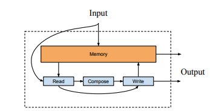
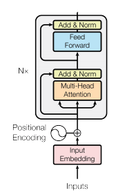

<div align="center">

<h1> Text Classification </h1>

*Implementations of models for text classification from various research papers*

</div>

The following models are implemented:
- Convolutional Neural Networks for Sentence Classification (Kim, 2014)
- Neural Semantic Encoders (Munkhdalai and Yu, 2017)
- Transformer Encoder - from Attention is All You Need (Vaswani et al., 2017)
- CNN with Recurrent Network Filter (Yang, 2018)


## TextCNN

[Convolutional Neural Networks for Sentence Classification](https://www.aclweb.org/anthology/D14-1181/)

<p align="center">
  
  <br>
  <em>TextCNN architecture. Source: (Kim, 2014)</em>
</p>

Run model using,

```
python scripts/textcnn/main.py
```

## Neural Semantic Encoders

[Neural Semantic Encoders](https://arxiv.org/abs/1607.04315)


<p align="center">
  
  <br>
  <em>NSE architecture. Source: (Munkhdalai and Yu, 2017)</em>
</p>

Run model using,

```
python scripts/nse/main.py
```

## Transformer

[Attention is All You Need](https://arxiv.org/abs/1706.03762)

<p align="center">
  
  <br>
  <em>NSE architecture. Source: (Vaswani et al., 2017)</em>
</p>

Run model using,

```
python scripts/transformer/main.py
```

## Convolutional Neural Networks with Recurrent Neural Filters

[Convolutional Neural Networks with Recurrent Neural Filters
](https://arxiv.org/abs/1808.09315)


Run model using,

```
python scripts/rnf/main.py
```
